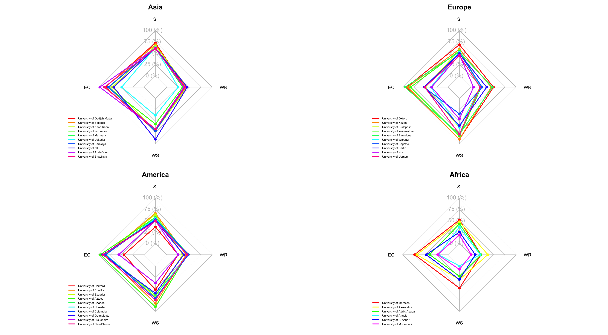

# Selection Assignment - Data Analysis and Development Specialist 

Welcome to this repository!

This repository contains the solutions and analyses I developed as part of the selection assignment for the **Data Analysis and Development Specialist** position at the **University of Indonesia UI GreenMetric**.

I am very enthusiastic about this opportunity and have put in my best effort in analyzing the university data and sustainability indicators provided, and identifying relevant insights.

## Assignment Summary & Data

This assignment focuses on analyzing data from **100 universities from various countries**. The data provided includes several key UI GreenMetric indicators, represented as scores:

* **Score EC**: **Economic Contribution / Impact** – The university's contribution to the economy, such as graduates entering the workforce, startups, patents, etc. In this analysis, the EC Score is also interpreted as a reflection of the **Social Impact** generated by the university through its economic contributions and innovation.
* **Score WS**: **World Scientific / Web of Science** – Scientific publications in internationally reputable journals or citation score.
* **Score WR**: **World Ranking** – The university's relative position in global rankings (e.g., QS, THE, Shanghai Ranking).
* **Score TR**: **Teaching & Research** – The quality of teaching and research at the university (e.g., number of PhD faculty members, research funding).
* **Score ED**: **Education Delivery / Educational Development** – Curriculum quality, learning facilities, accessibility, and academic development.
* **Score SI**: **Social Impact** — The university's social contributions to society, such as community service activities, local collaborations, inclusiveness, the social impact of research, and its role in sustainable development.

The main objective of this assignment is to analyze this data to understand the **competitive position and academic strength** of the universities.

## Visual Analysis: University Performance by Region (Radar Charts)

```py
data_asia <- data.frame(
   row.names = c("University of Gadjah Mada", "University of Sabanci", "University of Khon Kaen", "University of Indonesia", "University of Marmara", 
                 "University of Uskudar", "University of Sarakrya", "University of NTU", "University of Arab Open", "University of Brawijaya"),
   `SI` = c(1450,1375,1325,1250,1250,1250,1225,1225,1225,1200),
   `EC` = c(1700,1725,1400,1575,1560,985,1575,1335,1950,1750),
   `WS` = c(1425,1350,1425,1125,1425,750,1425,1800,1350,1350),
   `WR` = c(800,850,900,700,750,500,800,900,750,800)
 )
 
 
 # EUROPE
 data_europe <- data.frame(
   row.names = c("University of Oxford", "University of Kazan", "University of Budapest", "University of WarsawTech", "University of Barcelona",
                 "University of Warsaw", "University of Bogazici", "University of Bartin", "University of Koc", "University of Udmurt"),
   `SI` = c(1375,1175,1125,1100,1050,1040,995,975,925,885),
   `EC` = c(1825,1775,1000,1650,1900,760,1060,1050,725,1025),
   `WS` = c(1800,1800,1275,1650,1575,1275,675,1200,900,1575),
   `WR` = c(1000,900,410,460,950,450,500,700,120,410)
 )
 
 # AMERICA
 data_america <- data.frame(
   row.names = c("University of Harvard", "University of Brasilia", "University of Ecuador", "University of Azteca", "University of Charles", 
                 "University of Noreste", "University of Colombia", "University of Guanajuato", "University of RioJeneiro", "University of CasaBlanca"),
   `SI` = c(725,1325,1275,1150,1125,1100,1050,1005,1000,975),
   `EC` = c(885,1725,1700,1925,1700,1675,1700,1825,1115,1800),
   `WS` = c(1050,1650,1350,1800,1275,1425,1425,1200,750,1500),
   `WR` = c(500,850,700,900,950,900,950,750,500,900)
 )
 
 # AFRICA
 data_africa <- data.frame(
   row.names = c("University of Morocco", "University of Alexandria", "University of Addis Ababa", "University of Angola", "University of Al Azhar", "University of Moumouni"),
   `SI` = c(1030, 950, 855, 720, 495, 365),
   `EC` = c(1475, 1375, 810, 420, 960, 460),
   `WS` = c(975, 600, 450, 0, 600, 150),
   `WR` = c(450, 750, 450, 410, 200, 20)
 )
 
 # ------------------ PLOT ------------------
 
 # Panel 2x2
 par(mfrow=c(2,2), mar=c(1,2,2,1))
 make_radar(data_asia, "Asia")
 make_radar(data_europe, "Europe")
 make_radar(data_america, "America")
 make_radar(data_africa, "Africa")

```



