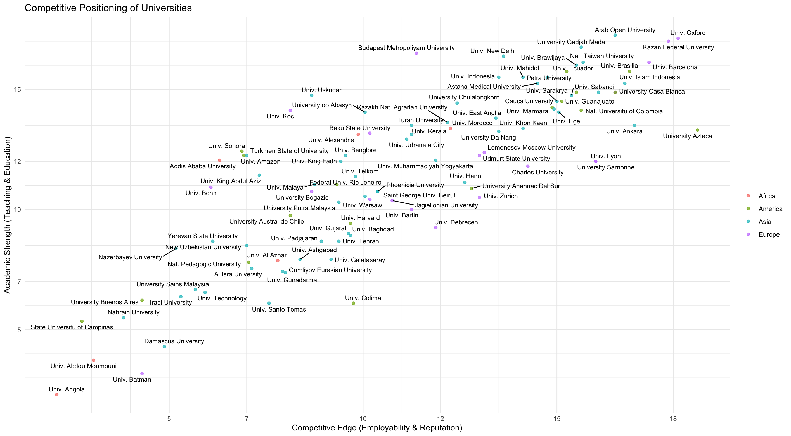

# Selection Assignment - Data Analysis and Development Specialist 

Welcome to this repository!

This repository contains the solutions and analyses I developed as part of the selection assignment for the **Data Analysis and Development Specialist** position at the **University of Indonesia UI GreenMetric**.

I am very enthusiastic about this opportunity and have put in my best effort in analyzing the university data and sustainability indicators provided, and identifying relevant insights.

## Assignment Summary & Data

This assignment focuses on analyzing data from **100 universities from various countries**. The data provided includes several key UI GreenMetric indicators, represented as scores:

* **Score EC**: **Economic Contribution / Impact** – The university's contribution to the economy, such as graduates entering the workforce, startups, patents, etc. In this analysis, the EC Score is also interpreted as a reflection of the **Social Impact** generated by the university through its economic contributions and innovation.
* **Score WS**: **World Scientific / Web of Science** – Scientific publications in internationally reputable journals or citation score.
* **Score WR**: **World Ranking** – The university's relative position in global rankings (e.g., QS, THE, Shanghai Ranking).
* **Score TR**: **Teaching & Research** – The quality of teaching and research at the university (e.g., number of PhD faculty members, research funding).
* **Score ED**: **Education Delivery / Educational Development** – Curriculum quality, learning facilities, accessibility, and academic development.
* **Score SI**: **Social Impact** — The university's social contributions to society, such as community service activities, local collaborations, inclusiveness, the social impact of research, and its role in sustainable development.

The main objective of this assignment is to analyze this data to understand the **competitive position and academic strength** of the universities.

##  University Performance by Region (Radar Charts)

```r
data_asia <- data.frame(
   row.names = c("University of Gadjah Mada", "University of Sabanci", "University of Khon Kaen", "University of Indonesia", "University of Marmara", 
                 "University of Uskudar", "University of Sarakrya", "University of NTU", "University of Arab Open", "University of Brawijaya"),
   `SI` = c(1450,1375,1325,1250,1250,1250,1225,1225,1225,1200),
   `EC` = c(1700,1725,1400,1575,1560,985,1575,1335,1950,1750),
   `WS` = c(1425,1350,1425,1125,1425,750,1425,1800,1350,1350),
   `WR` = c(800,850,900,700,750,500,800,900,750,800)
 )
 
 
 # EUROPE
 data_europe <- data.frame(
   row.names = c("University of Oxford", "University of Kazan", "University of Budapest", "University of WarsawTech", "University of Barcelona",
                 "University of Warsaw", "University of Bogazici", "University of Bartin", "University of Koc", "University of Udmurt"),
   `SI` = c(1375,1175,1125,1100,1050,1040,995,975,925,885),
   `EC` = c(1825,1775,1000,1650,1900,760,1060,1050,725,1025),
   `WS` = c(1800,1800,1275,1650,1575,1275,675,1200,900,1575),
   `WR` = c(1000,900,410,460,950,450,500,700,120,410)
 )
 
 # AMERICA
 data_america <- data.frame(
   row.names = c("University of Harvard", "University of Brasilia", "University of Ecuador", "University of Azteca", "University of Charles", 
                 "University of Noreste", "University of Colombia", "University of Guanajuato", "University of RioJeneiro", "University of CasaBlanca"),
   `SI` = c(725,1325,1275,1150,1125,1100,1050,1005,1000,975),
   `EC` = c(885,1725,1700,1925,1700,1675,1700,1825,1115,1800),
   `WS` = c(1050,1650,1350,1800,1275,1425,1425,1200,750,1500),
   `WR` = c(500,850,700,900,950,900,950,750,500,900)
 )
 
 # AFRICA
 data_africa <- data.frame(
   row.names = c("University of Morocco", "University of Alexandria", "University of Addis Ababa", "University of Angola", "University of Al Azhar", "University of Moumouni"),
   `SI` = c(1030, 950, 855, 720, 495, 365),
   `EC` = c(1475, 1375, 810, 420, 960, 460),
   `WS` = c(975, 600, 450, 0, 600, 150),
   `WR` = c(450, 750, 450, 410, 200, 20)
 )
 
 # ------------------ PLOT ------------------
 
 # Panel 2x2
 par(mfrow=c(2,2), mar=c(1,2,2,1))
 make_radar(data_asia, "Asia")
 make_radar(data_europe, "Europe")
 make_radar(data_america, "America")
 make_radar(data_africa, "Africa")

```


## 🌐 Continental University Insights via Radar Charts

These captivating radar charts offer a dynamic glimpse into the multifaceted performance of universities across **Asia**, **Europe**, **America**, and **Africa**. Each vibrant line traces the unique profile of a university across four critical **UI GreenMetric indicators**:

- **SI** – Social Impact  
- **WR** – World Ranking  
- **WS** – World Scientific Output  
- **EC** – Economic Contribution  

> 🧭 **Interpretation**: The farther a university’s line extends on an axis, the stronger its performance in that indicator.

---

### 🇪🇺 Europe: The Epitome of Balanced Excellence

**🧵 A Tapestry of Strength:**  
European universities consistently paint the largest and most evenly-filled “webs” on the radar. This signifies a **remarkable balance and high performance across all dimensions** — robust social impact, stellar global rankings, prolific scientific output, and significant economic contributions.

**🏛️ A Mature Ecosystem:**  
Europe showcases a mature academic landscape where institutions excel in delivering **comprehensive value and global impact**. Their radar charts are a testament to **well-rounded excellence**.

---

### 🌏 Asia: Rising Stars with Specialized Prowess

**📈 Peaks of Prominence:**  
Asian universities often feature sharp “spikes” in **World Ranking (WR)** and **World Scientific Output (WS)**, reflecting **strong research productivity and global visibility**.

**🌠 Dynamic and Diverse:**  
The variance in **Social Impact (SI)** and **Economic Contribution (EC)** highlights a dynamic region with both **established giants** and **emerging innovators** — suggesting room to broaden societal and economic engagement.

---

### 🌎 America: A Spectrum of Brilliance

**🚀 Pioneers and Potentials:**  
The Americas present a fascinating mix — with some institutions building **large, balanced webs rivaling Europe**, showcasing strength across all metrics.

**🔍 Diverse Paths:**  
However, a significant spread exists. Some universities show **focused strengths** in specific areas, while others reveal opportunities for growth — especially in **social and economic outreach**.

---

### 🌍 Africa: Charting a Course for Growth and Impact

**📉 Emerging Footprints:**  
African universities generally have **smaller radar areas**, but signs of strength in **Social Impact (SI)** and **Economic Contribution (EC)** are notable for several.

**🌍 Immense Potential:**  
The charts suggest that **strategic investment** in **research, visibility, and community engagement** can greatly elevate African institutions on the global academic map.

---

## Mapping University Competitive Positions

```r
library(ggplot2)
 library(dplyr)
 library(tidyr)
 library(forcats)
 library(ggrepel)
 

 data <- data_univ %>%
   mutate(
     Competitive_Edge = (`Score EC` + `Score WS`) / 2,  # Daya saing
     Academic_Strength = (`Score TR` + `Score ED`) / 2   # Kekuatan akademik
   )

 data <- data %>%
   mutate(
     Competitive_Edge_Scaled = Competitive_Edge / 100,
     Academic_Strength_Scaled = Academic_Strength / 100
   )

 ggplot(data = data, aes(x = Competitive_Edge_Scaled, y = Academic_Strength_Scaled)) +
   # Menggunakan Competitive_Edge_Scaled dan Academic_Strength_Scaled
   geom_point(aes(color = Region), size = 1.5, alpha = 0.7) +
   
   geom_text_repel(aes(label = `University Name`), size = 3) +
   
   labs(title = "Competitive Positioning of Universities",
        x = "Competitive Edge (Employability & Reputation)",
        y = "Academic Strength (Teaching & Education)") +
   

   scale_color_discrete(name = NULL) +
   
   scale_x_continuous(breaks = c(5, 7, 10, 12, 15, 18), # Sesuaikan dengan rentang data setelah dibagi 100
                      labels = c("5", "7", "10", "12", "15", "18")) + # Sesuai dengan breaks
   

   scale_y_continuous(breaks = c(5, 7, 10, 12, 15), # Sesuaikan dengan rentang data setelah dibagi 100
                      labels = c("5", "7", "10", "12", "15")) +
   
   theme_minimal()

```


